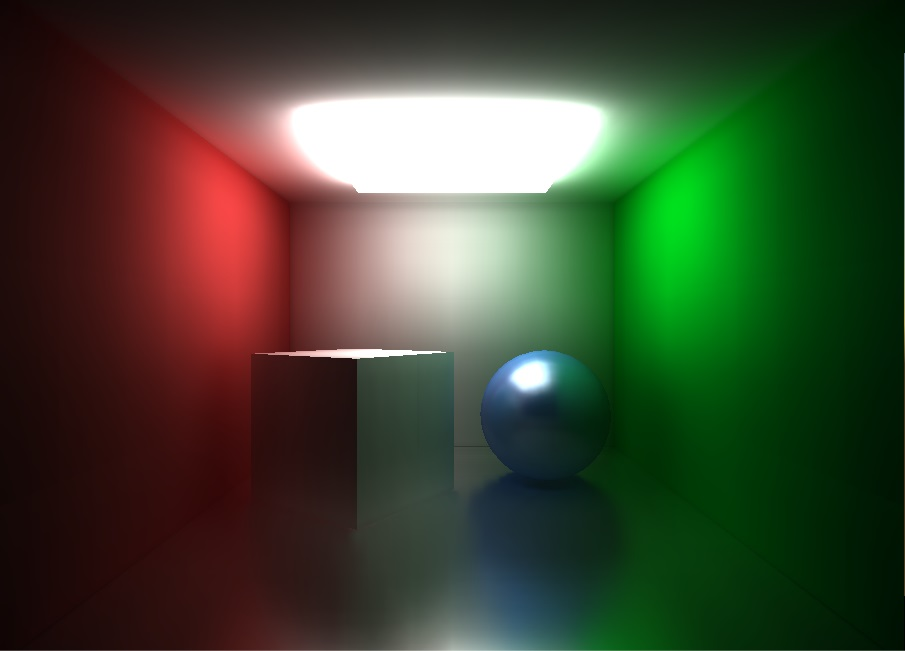

# Unity - Scriptable Render Pipeline - Voxel-based Global Illumination

## Showcase

- [Tutorial](https://youtu.be/nACG_mtSUDo)
- [Lighting Demo](https://youtu.be/thsw3c0SDIw)
- [The Room Demo](https://youtu.be/cOHHuDeXhgw)
- [Example project (legacy branch)](https://github.com/Looooong/Unity-SRP-VXGI/tree/legacy)

<p align="center">
  
  
</p>

## Requirements

- Unity 2018 (Experimental API). Using Unity 2019 would require slight modification to the code.
- Shader Model 4.5 or newer.
- Graphic API that supports geometry shader (this excludes Metal API).
- Approximately 1GB of VRAM for highest voxel resolution setting.

## Installation

[This method](https://docs.unity3d.com/Manual/upm-ui-giturl.html) is the easiest way to install a package. Just add the following dependency to `<project path>/Packages/manifest.json`:

```json
{
  "dependencies": {
    "com.looooong.srp.vxgi": "https://github.com/Looooong/Unity-SRP-VXGI.git"
  }
}
```

If you want to fiddle with the source code while using this package, you can [install the package locally](https://docs.unity3d.com/Manual/upm-ui-local.html).

For more information on how to manage UPM package, please refer to [this](https://docs.unity3d.com/Manual/upm-ui-actions.html).

## Contributing

All pull requests are welcome.

## License

[MIT](LICENSE.md)

## Acknowledgement

This project is inspired by [sonicether/SEGI](https://github.com/sonicether/SEGI).

Icons made by [Freepik](https://www.flaticon.com/authors/freepik) from [www.flaticon.com](https://www.flaticon.com).
